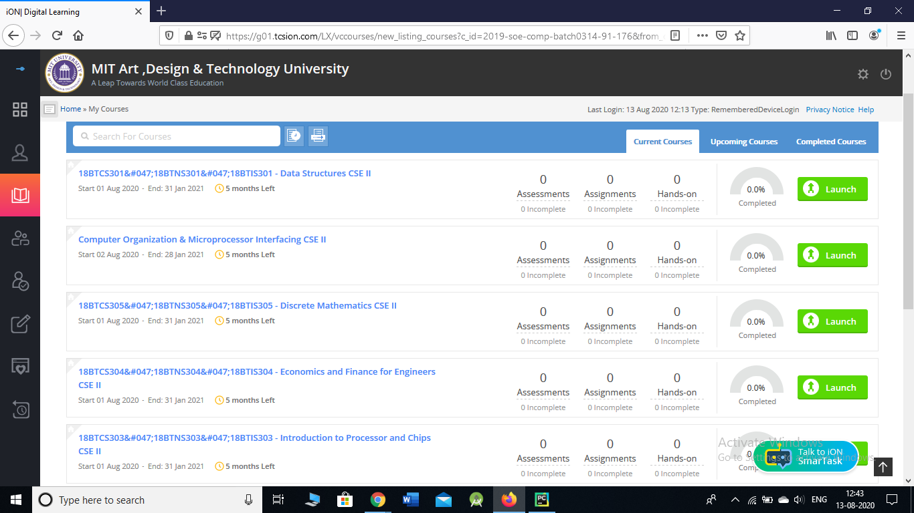
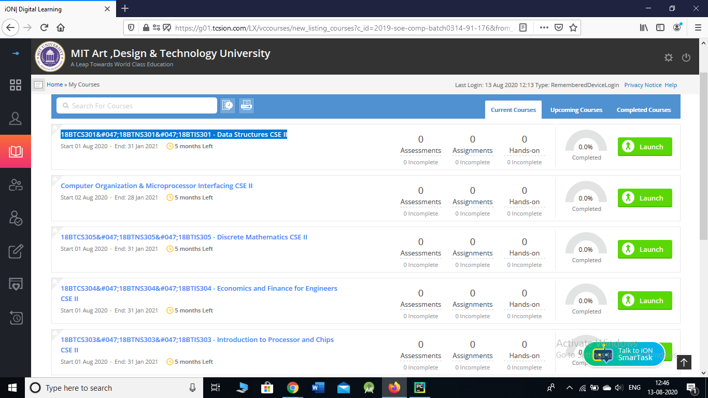

# onlineclass_bot

Hi Everyone.
My name is Abhay Babbar and I am a student of MIT ADT and I have Created a bot to automate the process of joining online lectures.

If you are a Student of MIT ADT, and if you currently in CSE2 Second year, then you can use the code by just changing the username and password.
Else, You have to make changes, because timetable is different and the links too.

And If you are not a student of MIT ADT or your classes are not on TCS ION, then you can maybe go through the code to learn new things!

Before running the code, you need to install libraries:
command given are for windows, if you are using mac or anything else, then you need to google the commands.
1. Selenium { pip install selenium }
2. openpyxl { pip install openpyxl }
3. time     { no need to install }
4. datetime { no need to install }
5. schedule { pip install schedule }

Install gecodriver from https://github.com/mozilla/geckodriver/releases
and extract all the files from it in C folder. {DO NOT CHANGE THE NAME}

Change username and password at line 44, 45 of code.

If you have some problem or some suggestions, you can DM me!
My linkedin Profile : https://www.linkedin.com/in/abhay-babbar-94718510a/

I have scheduled the program to run everyday at (09:33, 10:48, 12:03, 14:03, 15:18)
You can change it as per your schedule. { line 66 to 70 of code }

Right here, I am showing you how to change the links and the timetable.

1. Download timetable.xlsx and make changes in it according to your timetable. Prefer giving short names, like DS for data structures. (DO NOW CHANGE THE FORMAT)
2. Now we have to make changes in the code.
3. We have to make changes at line 12 of code. That is lecture dictionary.
4. Replace my subject names with that of yours. { Remember, the naming should match with the one you entered in timetable.xlsx }
5. Now we need to change the value of the dictionary. { link of subjects }
6. Go to courses section from tcs ion.

7. Now we need to copy the link and paste it in value of your respective subject key in lecture the lecture dictionary.

This is how my dictionary looks, your might look different:
lecture = {'IPC': "18BTCS303&#047;18BTNS303&#047;18BTIS303 - Introduction to Processor and Chips CSE II", "COMI": "Computer Organization & Microprocessor Interfacing CSE II", "DM": "18BTCS305&#047;18BTNS305&#047;18BTIS305 - Discrete Mathematics CSE II", "SHD": "German German-2 Year-TUESDAY-09.30-11.30", "EFE": "18BTCS304&#047;18BTNS304&#047;18BTIS304 - Economics and Finance for Engineers CSE II", "DS": "18BTCS301&#047;18BTNS301&#047;18BTIS301 - Data Structures CSE II", "PLI": "18BTCS311&#047;18BTNS311&#047;18BTIS311 - Programming Laboratory – I CSE II","PLII": "18BTCS312&#047;18BTNS312&#047;18BTIS312 - Programming Laboratory II CSE II", "MNI": "18BTCS321&#047;18BTNS321&#047;18BTIS321 - Mini Project –I CSE II"}

The Code will be updated soon for more functions.
